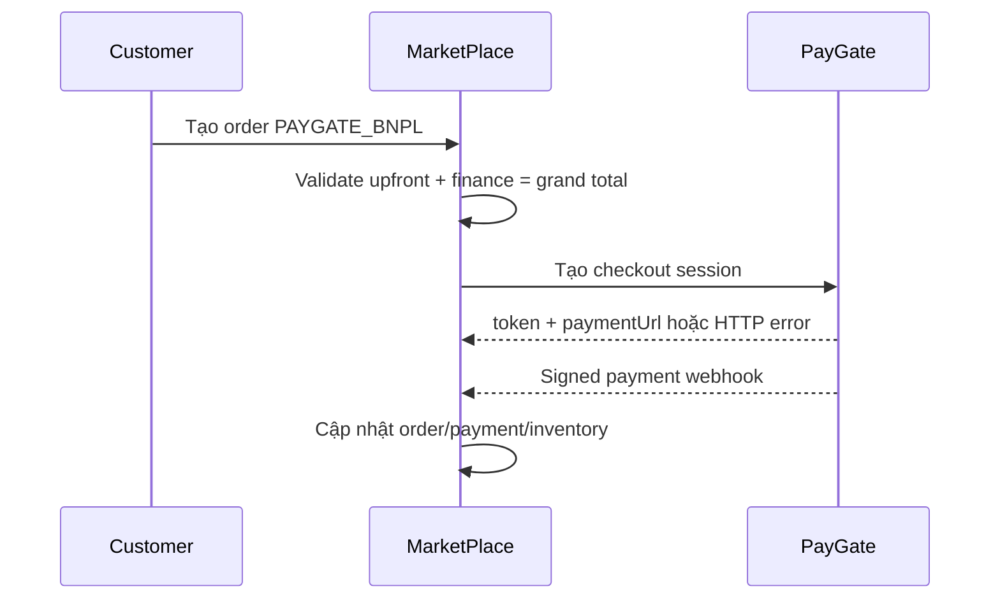

# MarketPlace — Báo cáo đối chiếu và khắc phục BNPL

> [!info] Phạm vi
> Báo cáo này chỉ đối chiếu các issue thuộc repository **MarketPlace**. Baseline review là nhánh `dev`, commit `e1ea09e`; bản khắc phục nằm trên nhánh `fix/bnpl-review-hardening`.

## 1. Kết luận điều hành

| Issue | Kết quả đối chiếu | Trạng thái hiện tại |
|---|---|---|
| `MP-BNPL-C1` | Chưa đủ căn cứ gọi là Critical security bug; cần chốt chính sách store credit/unwind loan | Không thay đổi theo yêu cầu |
| `MP-BNPL-H1` | Thiếu local validation là bug thật; exploit tài chính mô tả trong báo cáo gốc bị PayGate chặn | Đã fix |
| `MP-BNPL-H2` | Không đúng với state machine cancellation hiện tại | Không thay đổi theo yêu cầu |

> [!success] Phần đã khắc phục
> `MP-BNPL-H1` đã được xử lý ở cả DTO, service và PayGate client error handling. Hai issue còn lại được giữ nguyên đúng phạm vi yêu cầu.

## 2. Luồng tích hợp được đối chiếu



Các invariant phía MarketPlace:

- `upfrontAmount` và `financeAmount` không âm.
- Với order có giá trị, `financeAmount` phải lớn hơn 0 khi dùng BNPL.
- `upfrontAmount + financeAmount` phải bằng chính xác `grandTotal`.
- PayGate trả HTTP 4xx/5xx không được chuyển thành mock checkout thành công.
- Cancellation webhook pending không hoàn một khoản upfront chưa từng được thu.

## 3. Chi tiết issue

### MP-BNPL-C1 — Credit toàn bộ order vào Marketplace Wallet

> [!question] Không đủ căn cứ kết luận Critical
> Hành vi hiện tại là store-credit policy đã được triển khai có chủ ý, không phải bằng chứng trực tiếp của việc “mint tiền”. Khách vẫn mang nghĩa vụ trả `financeAmount` tại PayGate và đã trả `upfrontAmount`.

**Vị trí liên quan:**

- `backend/src/main/java/com/training/marketplace/service/impl/PaymentServiceImpl.java`
- `backend/src/test/java/com/training/marketplace/service/impl/PaymentServiceImplTest.java`
- `frontend/src/app/features/wallet/wallet.component.ts`

Marketplace Wallet hiện được dùng làm store credit khi checkout; review không tìm thấy luồng rút trực tiếp thành tiền mặt. Tuy nhiên, luồng cancellation/refund vẫn cần Product và Finance quyết định rõ một trong hai chính sách:

1. Giữ BNPL loan và hoàn toàn bộ giá trị hàng thành store credit.
2. Unwind loan/upfront/merchant settlement và không cấp full store credit.

**Trạng thái:** không sửa theo yêu cầu. Không nên thay đổi riêng một phía trước khi có chính sách kế toán end-to-end.

---

### MP-BNPL-H1 — Cho phép upfront/finance âm

> [!success] Đã fix
> Local validation đã được bổ sung trước khi reserve/save order; lỗi nghiệp vụ từ PayGate không còn bị che bằng mock checkout session.

**Vấn đề trước khi sửa:**

- `CreateOrderRequest` không có validation số không âm.
- `OrderServiceImpl` chỉ kiểm tra tổng split bằng grand total.
- `PaygateClientServiceImpl` fallback mock cho mọi exception, kể cả PayGate từ chối split bằng HTTP error.

**Khắc phục:**

- Thêm `@PositiveOrZero` cho `upfrontAmount` và `financeAmount`.
- Service từ chối split âm và từ chối `financeAmount = 0` với BNPL order có giá trị.
- Giữ invariant tổng split bằng chính xác grand total.
- Chỉ giữ mock fallback cho lỗi kết nối `ResourceAccessException` phục vụ local offline mode.
- HTTP rejection và lỗi tích hợp bất thường được trả về như lỗi nghiệp vụ, không tạo mock token.

**File thay đổi:**

- `backend/src/main/java/com/training/marketplace/dto/request/CreateOrderRequest.java`
- `backend/src/main/java/com/training/marketplace/service/impl/OrderServiceImpl.java`
- `backend/src/main/java/com/training/marketplace/service/impl/PaygateClientServiceImpl.java`
- `backend/src/test/java/com/training/marketplace/service/OrderServiceTest.java`
- `backend/src/test/java/com/training/marketplace/service/impl/PaygateClientServiceImplTest.java`

---

### MP-BNPL-H2 — Không refund upfront khi nhận cancellation webhook

> [!failure] Không đúng với state machine hiện tại
> PayGate chỉ cho cancel checkout khi session còn `PENDING`. Tại trạng thái này, BNPL confirm chưa chạy và upfront chưa bị trừ.

BNPL confirm phía PayGate thực hiện trừ upfront, tạo loan/schedules, disbursement và chuyển session sang `SUCCESS` trong cùng transaction. Nếu một bước lỗi, transaction rollback; không tồn tại committed state “đã trừ upfront nhưng proposal bị cancel trước khi tạo loan” như kịch bản nguồn.

Webhook cancellation đến sau khi Marketplace đã `PAID` cũng được terminal-state guard bỏ qua để không release stock/refund sai.

**Trạng thái:** không sửa theo yêu cầu. Refund sau khi BNPL đã settle phải thuộc flow order refund/unwind riêng, không phải handler `PAYMENT_CANCELLED` của pending checkout.

## 4. Kiểm thử

```powershell
cd backend
.\mvnw.cmd test "-Dtest=OrderServiceTest,PaygateClientServiceImplTest"
.\mvnw.cmd test "-Dtest=!*IntegrationTest"
```

Kết quả:

- Focused regression: **14/14 PASS**.
- MarketPlace backend unit suite: **413/413 PASS**.
- `git diff --check`: **PASS**.

## 5. Kết luận

> [!summary]
> Phần MarketPlace đã đóng local validation/error-masking bug `MP-BNPL-H1`. `MP-BNPL-C1` được giữ lại như một quyết định nghiệp vụ cần Product/Finance xác nhận; `MP-BNPL-H2` không được sửa vì kịch bản báo cáo không phù hợp với state machine hiện tại.
